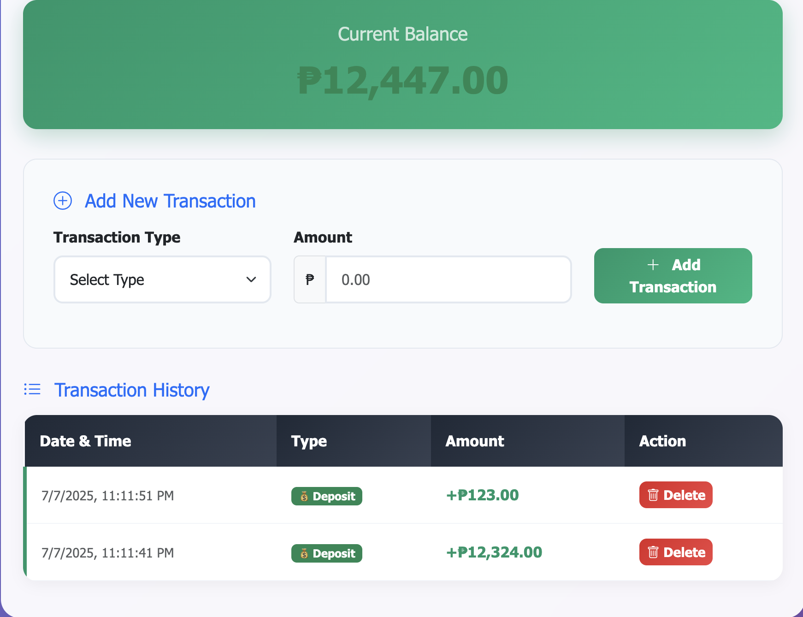

# 🧾 Banking Transaction Tracker

A practical web app developed during Chinabank’s Developer Upskilling Program. This demo project showcases real-world banking features using **JavaScript (OOP + DOM)**, **Bootstrap 5**, and **Local Storage** — designed to help internal devs modernize their legacy systems.

---

## 🚀 Project Overview

This tracker allows users to:

- Add income/expense transactions
- Calculate total balance
- Store data in localStorage
- Manipulate the DOM dynamically
- Use `Intl.NumberFormat` for formatting
- Practice JS OOP principles and module structure

---

## 🛠️ Technologies Used

- HTML5 / CSS3
- Bootstrap 5
- JavaScript ES6+
- DOM Manipulation
- Object-Oriented Programming
- Local Storage
- Async/Await (Simulated fetch)

---

## 📦 Features

- ✅ Add and remove transactions
- ✅ Real-time balance updates
- ✅ Persist transactions using localStorage
- ✅ User-friendly Bootstrap interface
- ✅ Async simulation with `await fetch`
- ✅ Organized OOP structure for scalability

---

## 🧠 Learning Goals

This project helped Chinabank devs:

- Transition from jQuery to modern JavaScript
- Understand DOM interaction without libraries
- Apply modular, OOP-based JS structures
- Work with data persistence in web apps
- Improve UI using responsive design (Bootstrap)

---

## 🌐 Live Demo

👉 [View App on Netlify](https://chinabank-js-tracker.netlify.app)

---

## 📸 Screenshots

### Dashboard

### Add Transaction

---

## 👨‍🏫 Developed By

**Bobby Ferrer**  
Web Development Instructor — TESDA Certified  
Corporate Trainer | Active Learning Philippines

---

## 📄 License

This project was built exclusively for internal training purposes. Not intended for production use.
